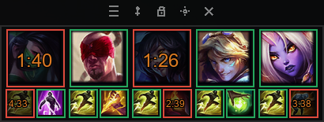

# League of Legends Spell Tracker

<div align="center">



**Compact overlay for tracking enemy ultimate and summoner spell cooldowns in League of Legends**


</div>

---

## 📋 Description

Lightweight overlay application for tracking enemy ultimate and summoner spell cooldowns in League of Legends. Features automatic champion loading from live games, intelligent level detection, and real-time cooldown tracking to help you make better decisions during matches.

## ✨ Features

### Auto-Load & Intelligence
- 🎮 **Auto-load from game** - automatically detects enemy champions when entering a match (uses Riot Live Client Data API)
- 🧠 **Smart level detection** - tracks enemy champion levels in real-time and adjusts ultimate cooldowns (6/11/16)
- 📊 **Role-based sorting** - enemy champions auto-arrange by position (TOP→JUNGLE→MID→ADC→SUPPORT)
- 🔄 **Auto-clear** - resets all icons when game ends

### Tracking & Timers
- 🎯 **5 enemy slots** - track opposing team's ultimates and summoner spells
- ⏱️ **Accurate timers** - automatic cooldown selection based on level
- 🧮 **Ability haste calculation** - real-time cooldown adjustments based on enemy items (90+ items tracked)
  - **Ultimate haste** - tracks Malignance (+20 ult haste) and Experimental Hexplate (+30 ult haste)
  - **Summoner haste** - tracks Ionian Boots of Lucidity (+12) and Cosmic Insight rune (+18)
  - **Ability haste** - calculates from all enemy items for accurate ultimate cooldowns
- 🖼️ **Visual icons** - all 171 champions with ultimate ability icons + summoner spells
- 🔇 **Gray inactive icons** - champions below level 6 display grayed out (configurable)
- 🔊 **Sound alerts** - customizable notifications when ultimates are ready

### Interface & Customization
- 🎨 **Compact design** - minimalist interface with scalable UI (0.5x-2.0x)
- 📏 **Adjustable spacing** - customize distance between champion icons (0-20px)
- 🏷️ **Champion names** - optional display of champion names and levels
- 🎨 **Visual effects** - color-coded borders (red=active, green=ready)
- 🔄 **Layout toggle** - switch between horizontal and vertical layouts
- 🔍 **Semi-transparent** - doesn't block game view
- 🔝 **Always on top** - window stays visible over the game

### Controls & Settings
- 🖱️ **Drag & Drop** - move the window anywhere on screen
- 🔒 **Lock mode** - prevent accidental changes during gameplay
- 📍 **System tray** - minimize to tray and quick exit
- ⚙️ **Settings dialog** - configure all features (sound, icons, auto-load, spacing, etc.)

## 🚀 Quick Start

### For Users (Recommended)

1. **Download** the latest release from [Releases](https://github.com/devcasian/League-of-Legends-Spell-Tracker/releases)
2. **Run** `Spell-Tracker.exe`
3. **No installation required** - the executable contains everything needed

### For Developers

If you want to modify the code or contribute:

#### Requirements

- Python 3.13 or newer
- Pillow (PIL) for image processing

#### Installation Steps

1. **Clone the repository:**
```bash
git clone https://github.com/devcasian/League-of-Legends-Spell-Tracker.git
cd League-of-Legends-Spell-Tracker
```

2. **Install dependencies:**
```bash
pip install -r requirements.txt
```

3. **Run the application:**
```bash
python run.py
```

4. **Build executable (optional):**
```bash
python build.py
```

**Note:** If you have a `settings.json` in the project directory, the build script will use those values as defaults for the compiled executable. This lets you customize default settings for distribution.

## 🎮 Usage

### Automatic Mode (Recommended)

When **Auto-load from game** is enabled (default):

1. **Start a League of Legends match**
2. **Enemy champions auto-load** when game starts (sorted by role)
3. **Levels auto-update** every 3 seconds during the game
4. **Icons auto-clear** when game ends
5. **Manual editing disabled** - right-click level changes and double-click champion selection are locked

The overlay automatically connects to Riot's Live Client Data API (https://127.0.0.1:2999) to fetch real-time game data.

### Manual Mode

When auto-load is disabled, you can manually configure each slot:

#### Champion Slots
- **Double-click (LMB)** on champion icon → Open champion selection window
- **Left-click (LMB)** → Start/reset ultimate timer
- **Right-click (RMB)** → Cycle ultimate level (6 → 11 → 16)
  - Current level is displayed in champion name (e.g., "Lux (6)", "Ahri (11)")

#### Summoner Spell Slots
- **Double-click (LMB)** on summoner spell icon → Open spell selection window
- **Left-click (LMB)** → Start/reset spell timer

### Menu Bar Controls

- **Layout toggle** - Switch between horizontal/vertical layouts
- **Pin button** - Save current window position
- **Lock button** - Lock overlay (prevents window movement and champion changes)
- **Settings** - Open settings dialog (sound, volume, alert threshold, UI scale, auto-load, etc.)
- **Close (X)** - Exit application

### System Tray

- **Right-click tray icon** → Open menu
  - **Show/Hide** - Toggle overlay visibility
  - **Exit** - Close application

### Window Movement

- **Drag empty area** → Move window (when not locked)

### Visual Indicators

- **Red border** - Timer is active (ability on cooldown)
- **Green border** - Ability is ready (after first use)
- **Gray border** - Empty slot
- **Grayed icon** - Champion below level 6 (ultimate not available yet)

## 🗂️ Project Structure

```
League-of-Legends-Spell-Tracker/
├── run.py                              # Application entry point
├── build.py                            # Build script for creating .exe
├── spell-tracker.spec                  # PyInstaller configuration
├── requirements.txt                    # Python dependencies
├── README.md                           # Documentation
├── LICENSE                             # MIT license
├── .gitignore                          # Git ignore rules
├── .gitattributes                      # Git attributes
├── .github/workflows/
│   └── build-release.yml               # GitHub Actions auto-build
├── src/                                # Source code
│   ├── overlay.py                      # Main GUI application
│   ├── champion_data.py                # Champion data loader
│   ├── timer.py                        # Cooldown timer logic
│   ├── auto_loader.py                  # Auto-load game data monitor
│   ├── live_client_api.py              # Riot Live Client Data API
│   ├── haste_calculator.py             # Ability haste calculations
│   ├── config.py                       # Application settings
│   └── settings.py                     # Settings persistence
└── data/                               # Game data
    ├── game_data/                      # JSON data files
    │   ├── champions_ult_cooldowns.json
    │   ├── summoner_spells_cooldowns.json
    │   └── items_haste.json            # Item ability haste data (90 items)
    ├── icons/                          # Icon assets
    │   ├── champions/                  # Champion portrait icons (171 files)
    │   ├── champion_ults/              # Ultimate ability icons (171 files)
    │   └── summoner_spells/            # Summoner spell icons (10 files)
    ├── sounds/                         # Audio files
    │   └── ult_ready.wav
    └── assets/                         # Application assets
        ├── logo.ico
        └── app_logo.png                # Application screenshot
```

## ⚙️ Configuration

### In-App Settings

Click the **Settings button** in the menu bar to configure:

#### Sound & Alerts
- **Sound Enabled** - Toggle sound notifications on/off
- **Sound Volume** - Adjust volume (0.0 - 1.0)
- **Alert Threshold** - Set when to play sound (seconds before ready)

#### Visual Options
- **Use champion icons** - Switch between champion portraits and ultimate ability icons
- **UI Scale** - Scale interface size (0.5x - 2.0x)
- **Slot Spacing** - Adjust distance between champion icons (0-20px)

#### Auto-Load Options
- **Auto-load from game** - Automatically detect enemy champions from live games
- **Show champion names** - Display champion names and levels below icons
- **Gray out icons below level 6** - Show inactive/grayed icons for champions without ultimate

Settings are automatically saved to:
- **Windows**: `%APPDATA%\SpellTracker\settings.json`
- **Linux**: `~/.config/spell-tracker/settings.json`

This means you can move the .exe anywhere and your settings will persist!

### Advanced Configuration

Edit `src/config.py` to customize:

```python
# Window & Visual Settings
OVERLAY_ALPHA = 0.95                # Window transparency
ICON_SIZE = 64                      # Base icon size (before scaling)
OVERLAY_BG_COLOR = "#0a0a0a"        # Background color
TIMER_COLOR = "#ffffff"             # Timer text color
READY_BORDER_COLOR = "#27ae60"      # Ready state color (green)
ACTIVE_BORDER_COLOR = "#e74c3c"     # Active timer color (red)
TIMER_FONT = ("Arial", 18, "bold")  # Timer font

# Auto-Load Settings
AUTO_LOAD_ENABLED = True            # Enable auto-load by default
AUTO_LOAD_POLL_INTERVAL = 3.0       # API polling interval (seconds)
SHOW_CHAMPION_NAMES = False         # Show champion names by default
GRAY_LOW_LEVEL_ICONS = True         # Gray out low-level champions

# UI Defaults
DEFAULT_SLOT_SPACING = 2            # Default spacing between icons
UI_SCALE = 1.1                      # Default UI scale

# Debug
DEBUG_MODE = False                  # Debug mode (shorter cooldowns)
```

## 🤝 Contributing

Contributions are welcome! If you have suggestions or found a bug:

1. Fork the repository
2. Create a feature branch (`git checkout -b feature/AmazingFeature`)
3. Commit your changes (`git commit -m 'Add some AmazingFeature'`)
4. Push to the branch (`git push origin feature/AmazingFeature`)
5. Open a Pull Request

## 📝 TODO

- [x] Sound notifications when ultimate is ready
- [x] Support for summoner spells
- [x] Compact mode (level displayed in champion name)
- [x] Automatic champion loading from live games
- [x] Real-time level detection and tracking
- [x] Adjustable slot spacing
- [x] Support for ability haste calculation
- [ ] Theme customization (custom colors/fonts)

## 📄 License

This project is distributed under the MIT License. See the [LICENSE](LICENSE) file for details.

---

<div align="center">

**Made with ❤️ for the League of Legends community**

[Report Bug](https://github.com/devcasian/League-of-Legends-Spell-Tracker/issues) · [Request Feature](https://github.com/devcasian/League-of-Legends-Spell-Tracker/issues)

</div>